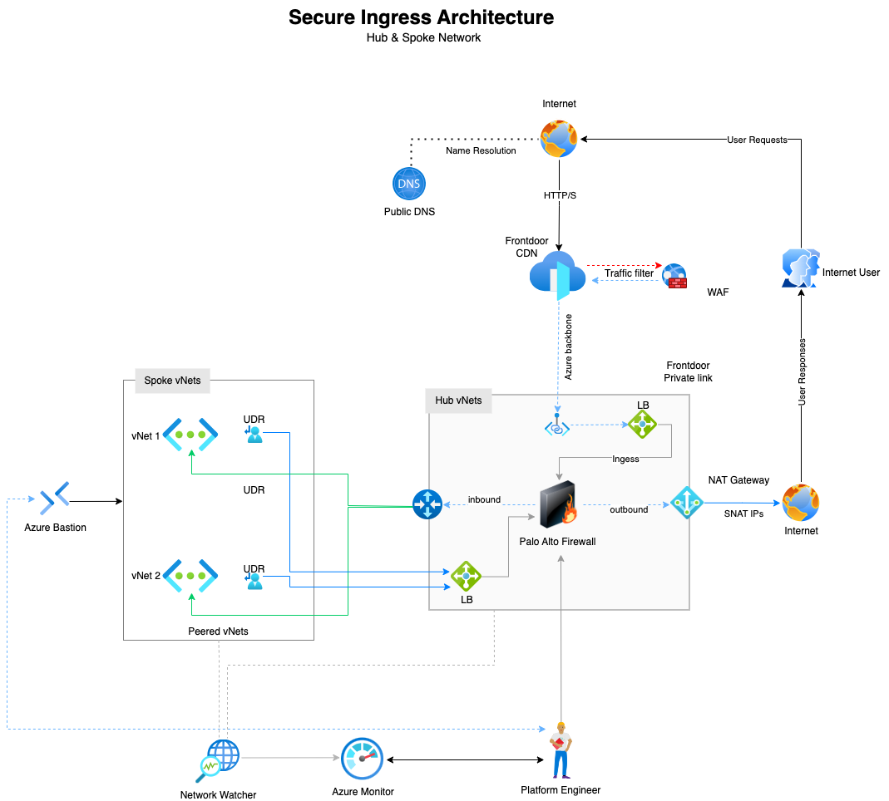

## Project Summary

Partedwaves Ltd delivers web-based services to a global client base. To support secure and scalable internet-facing applications, they require an Azure-based architecture that enables reliable access to backend services developed by their engineering team.

They are considering Azure Front Door for global traffic distribution and CDN capabilities. 

Your objective is to design and deploy the necessary infrastructure to securely expose these services to users worldwide, ensuring performance, availability, and protection.

## Pre-requisite and Assumptions

- You have you own Azure account or have and Azure account where you have sufficient permissions to deploy resources.
- You can login to your Azure portal via `az` cli from your terminal.
- To limit complexity of the project, we'll not be deploying via a CI/CD  pipeline.
- You own a domain name that you can use.
- You have Terraform installed on your local machine

## What we will build

In this project, we’ll design and deploy a secure, scalable hub-and-spoke network architecture in Azure. The setup includes two spoke virtual networks—each hosting a virtual machine—connected to a centralized hub network that provides shared security, connectivity, and management services.

The hub network hosts a Palo Alto firewall for traffic inspection, a NAT Gateway for secure and consistent outbound internet access, and Azure Bastion for remote administration without exposing public IPs. Inbound traffic enters through Azure Front Door Premium integrated with Private Link, protected by Front Door WAF policies for Layer 7 (application-level) inspection.

All spoke virtual machines route their traffic through user-defined routes (UDRs) that direct flows to an internal load balancer connected to the firewall, ensuring centralized inspection and control. Importantly, east-west traffic between spokes will traverse the hub, as there is no direct spoke-to-spoke peering, enforcing a single inspection and control point.

This architecture demonstrates how to implement centralized security, controlled outbound connectivity, and full inspection of north-south and east-west traffic using Azure-native services combined with a third-party firewall, aligning with Zero Trust network design principles.

## Architecture

<details>
<summary>Project Architecture Diagram</summary>



</details>

## Project Repository

You can find the project repository the [secure-Ingress-via-azure-frontdoor](https://github.com/madjava/secure-Ingress-via-azure-frontdoor) repository.

Clone the repo
```bash
git clone <repo-url>
```

After cloning, follow the `README.md` file and go through the steps.

## Pros and Cons of the Design

### Pros (Advantages)

* **Centralized Security Control**

    All inbound, outbound, and east-west traffic is funneled through the Palo Alto firewall, enabling consistent inspection, policy enforcement, and unified logging.

* **Simplified Management**

    Shared services like NAT Gateway, Bastion, and Front Door are hosted centrally in the hub—simplifying operations and updates.

* **Enhanced Outbound Security**
    The NAT Gateway provides predictable outbound traffic with static egress IPs, improving security and compliance tracking.

* **Layer 7 Protection**
    Azure Front Door WAF adds application-layer (L7) defense, protecting against web attacks such as SQL injection, XSS, and DDoS.

* **Improved East-West Visibility**

    With no direct spoke-to-spoke peering, all lateral traffic passes through the hub firewall, improving visibility and preventing lateral movement.

* **Scalable and Modular**

    New spokes or workloads can be added seamlessly—each benefits from the existing centralized controls and security stack.

* **Zero Trust Alignment**

    The design enforces segmentation, centralized inspection, and least-privilege access—core Zero Trust principles.

### Cons (Trade-offs / Limitations)

* **Increased Complexity**

    The architecture requires careful configuration of UDRs, load balancers, and firewall policies, increasing design complexity.

* **Added Latency**

    Routing all east-west and north-south traffic through the hub firewall introduces additional hops and potential latency.

* **Higher Costs**

    Premium services—Azure Front Door, NAT Gateway, Palo Alto firewall, and Bastion—add to overall deployment cost.

* **Throughput Bottlenecks**

    Improper sizing of the firewall or load balancer can limit performance under heavy workloads.

* **Reliance on Custom Routing**

    Azure’s non-transitive VNet peering model requires manual routing (via UDRs) for spoke-to-spoke communication, adding maintenance overhead.

## Estimated Cost Considerations

In any medium to large-scale cloud project, understanding and managing infrastructure costs is critical. Cloud operational expenses can escalate rapidly if not planned and monitored effectively. A proactive approach to cost estimation ensures that investments are aligned with business value and technical requirements.

### Common Cost Drivers

#### Networking Costs

* **East-West Traffic:**  Internal service-to-service communication within a region or across zones.
* **North-South Traffic:** Ingress and egress to/from the internet, often impacted by firewall, load balancer, and NAT gateway configurations.
* **Cross-Region Traffic:** Data transfer between Azure regions can be significantly more expensive and should be justified by business continuity or latency requirements.

#### Storage Costs

* **Log Retention:** Services like Log Analytics Workspace and Azure Monitor can accumulate large volumes of logs. Long retention periods and high ingestion rates drive up costs.
* **Blob Storage:** Used for backups, telemetry, and diagnostics. Costs vary by redundancy tier (LRS, GRS) and access patterns (hot, cool, archive).
* **Premium Storage SKUs:** Often used for performance-sensitive workloads but must be justified by actual IOPS requirements.

#### Resource SKU Selection

Choosing the right VM sizes, AKS node pools, or App Service plans is essential.
Over-provisioning leads to waste; under-provisioning affects performance.
Use Azure Advisor and workload profiling to guide right-sizing decisions.

## Room for Improvement

While this is a common architecture pattern, there is room for improvement or adaptation. Happy to hear your ideas.

## Next steps

- **Challenge yourself:** Attempt to deploy the project code via Azure DevOps pipeline, Github Actions, Jenkins, Argos CD or whatever CI tool you are comfortable with. You can find some blogs on how to do this at [Thomas Thornton Blog](https://thomasthornton.cloud/)
- **Further learning:** Azure has lots of great content regarding [network architectures](https://learn.microsoft.com/en-us/azure/architecture/networking/), do check them out and try
